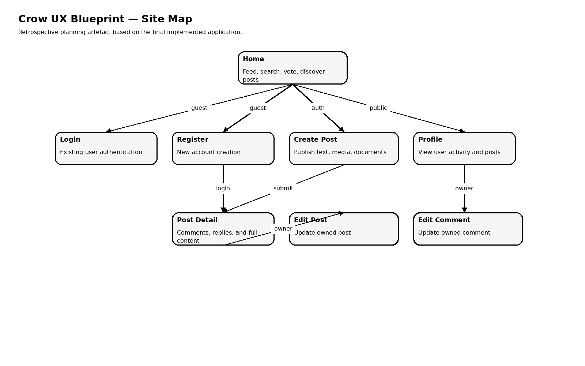
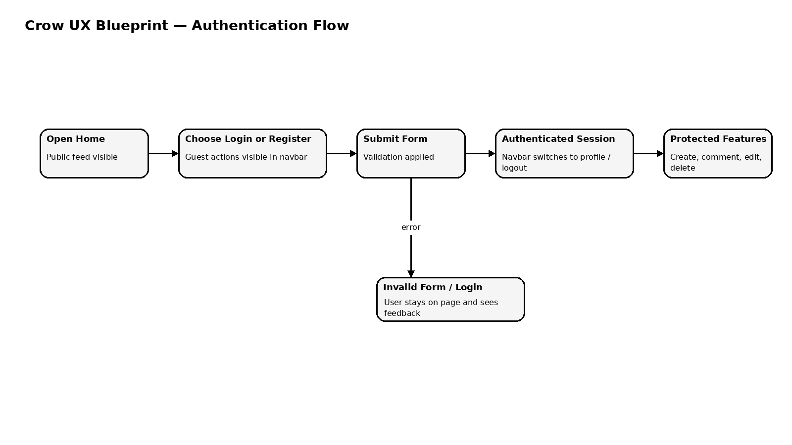
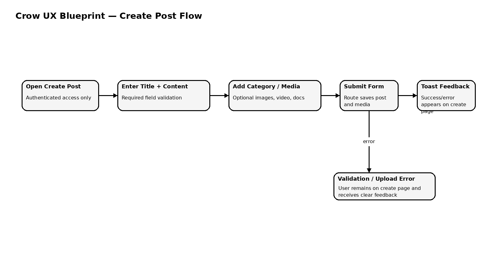
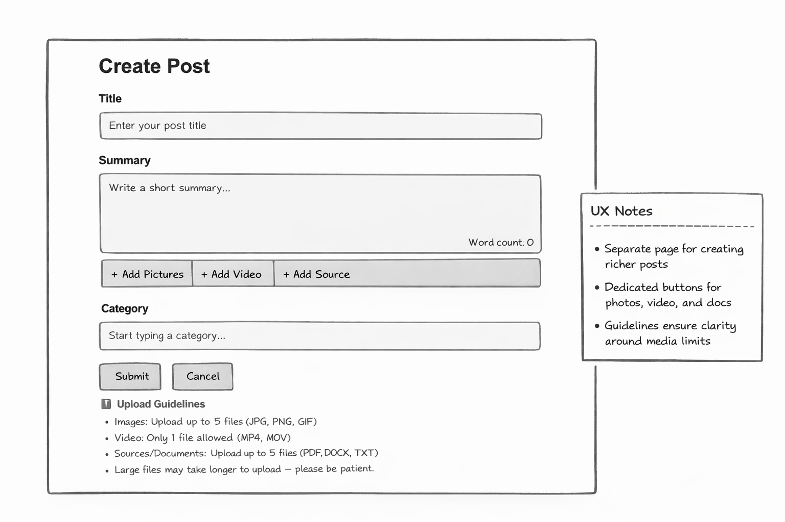
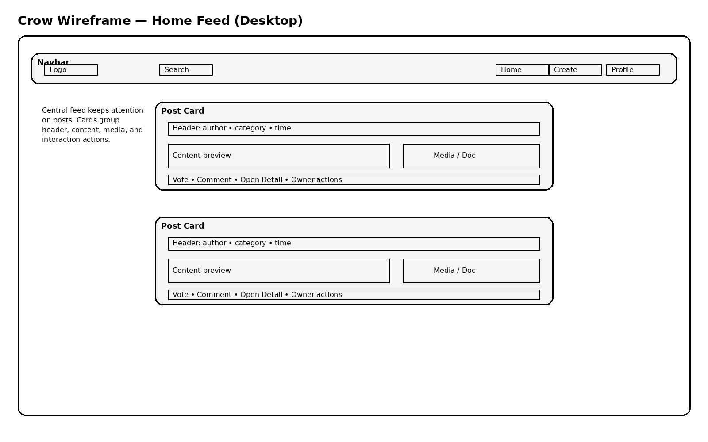
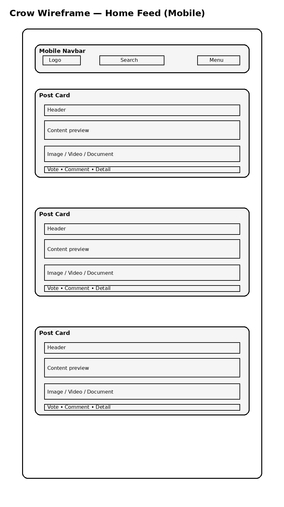
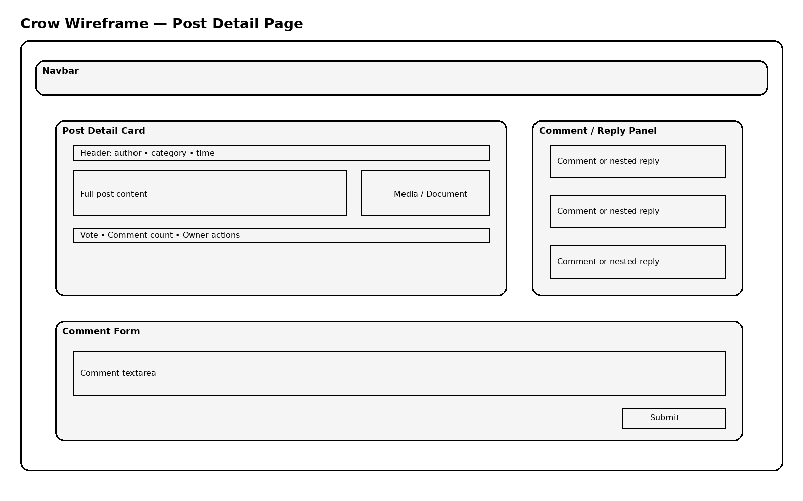
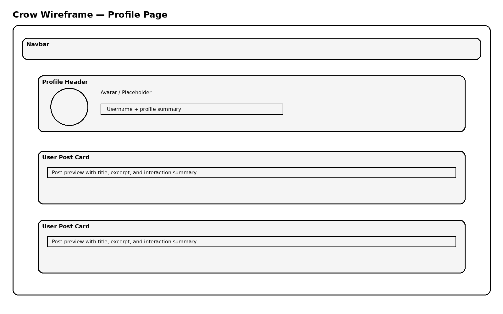
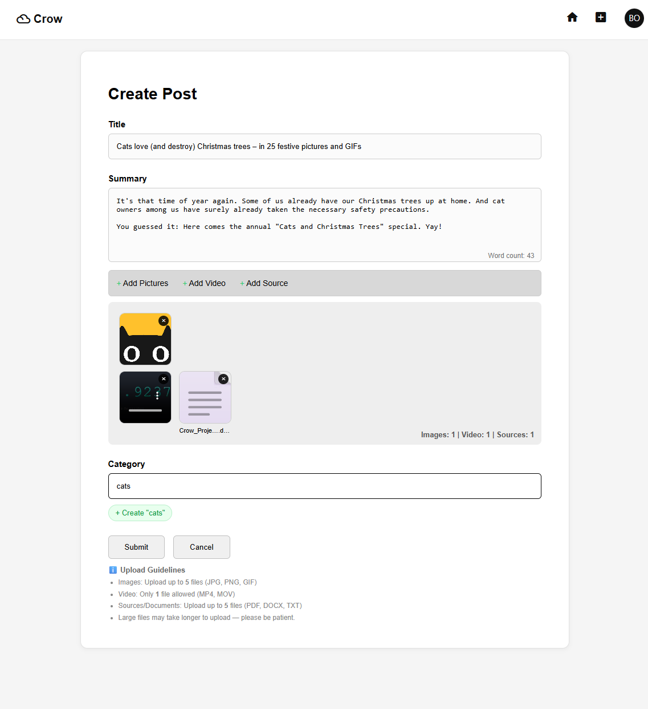
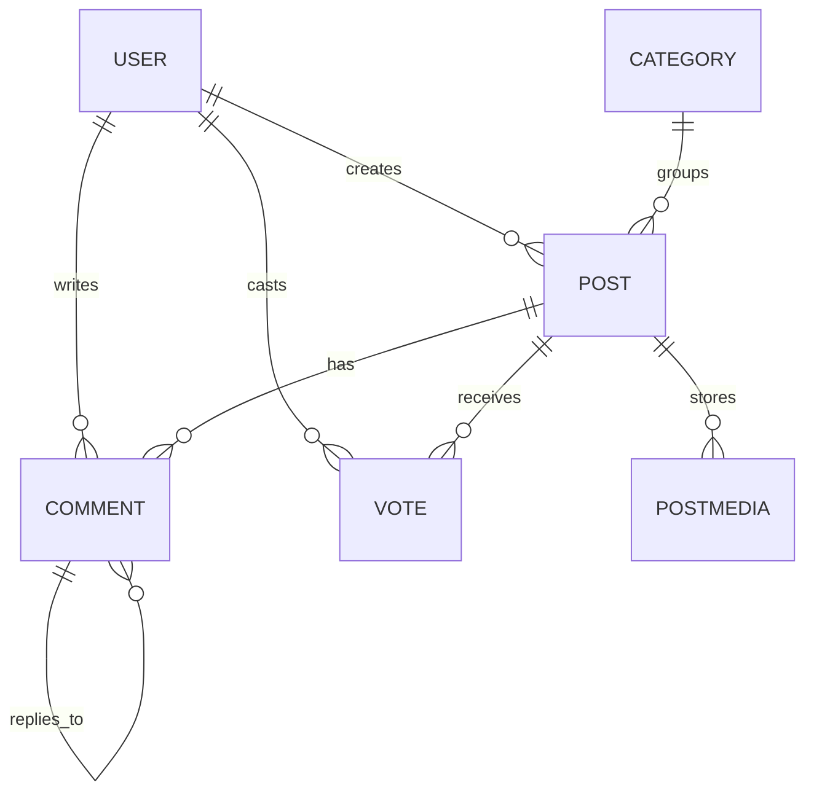

# Crow – Social Feed Platform

Crow is a database-backed Django social platform where registered users can create posts, upload media, vote on content, comment on discussions, reply to other users, search the feed, and manage their own content. The application demonstrates a complete full-stack workflow using Django, PostgreSQL, JavaScript, HTML, CSS, Git, GitHub, Cloudinary, and Heroku.

## Live Project

* Live site: [https://crow-social-feed-a61d23c4775f.herokuapp.com/](https://crow-social-feed-a61d23c4775f.herokuapp.com/)
* Repository: [https://github.com/boneyphilip/crow-v2](https://github.com/boneyphilip/crow-v2)

## Project Goals

### User goals

* Register and log in securely.
* Create and share posts with text and optional media.
* Discover interesting content through the feed and live search.
* Interact with posts through voting, comments, and replies.
* Edit or delete their own content without affecting other users.

### Site owner goals

* Provide a community-driven discussion platform.
* Store data in a structured relational database.
* Restrict sensitive actions to authenticated users.
* Deliver a responsive experience across device sizes.
* Deploy the application securely using environment variables.

## Project Rationale

Crow was designed as a social feed platform for users who want to share short-form content and interact with a community through posts, comments, replies, and voting in a simple and familiar interface. The domain was chosen because it naturally supports relational data, user permissions, CRUD operations, and asynchronous interactions such as voting and search suggestions.

The project serves as a practical example of a centrally managed dataset where:

* authenticated users create and manage their own records;
* visitors can browse public content;
* business rules control editing, deleting, and voting;
* the system gives clear feedback after user actions.

## UX Design

### Design principles

1. **Clarity** – a familiar feed layout keeps the learning curve low.
2. **Consistency** – navigation, buttons, cards, and interaction patterns are repeated throughout the site.
3. **User control** – users can create, edit, delete, vote, and reply without confusion.
4. **Feedback** – Django messages and JavaScript interactions confirm actions.
5. **Responsiveness** – layouts adapt across desktop, tablet, and mobile breakpoints.

### Main views

* Home feed
* Create post page
* Post detail page
* Edit post page
* Edit comment page
* Login page
* Register page
* Profile page

### UX Planning Artefacts

To document the design process more clearly, retrospective UX artefacts were created based on the final implemented version of the application.

These artefacts reflect the final structure, user flows, page layouts, and navigation logic of the implemented and deployed application. They are included to provide clear UX planning evidence that maps directly to the implemented application.

#### Site map and user flows





#### Low-fidelity page wireframes







### Responsive mockups





More detailed design notes are documented in [UX.md](UX.md).

## Agile Planning

The project uses an Agile planning structure based on epics, user stories, acceptance criteria, MoSCoW prioritisation, and implementation tasks. The full planning evidence is documented in [AGILE.md](AGILE.md).

## Existing Features

### Authentication and account access

* Users can register, log in, and log out.
* Restricted actions require authentication.
* The navigation reflects the current login state.

### Post CRUD functionality

* Authenticated users can create posts.
* Post authors can edit their own posts.
* Post authors can delete their own posts.
* Visitors and non-owners cannot access restricted edit/delete actions.

### Media handling

* Users can attach images, videos, and documents to posts.
* Single media and gallery layouts are handled separately.
* Images and videos open in a lightbox; documents open as normal file links.

### Voting system

* Logged-in users can upvote or downvote posts.
* Clicking the same vote again removes it.
* Switching vote direction updates the score immediately.

### Comments and replies

* Logged-in users can comment on posts.
* Users can reply to comments to create threaded discussion.
* Users can edit or delete only their own comments.

### Search and discovery

* AJAX search returns matching posts and authors.
* Category suggestions are shown while creating posts.
* User profile pages display posts by a selected author.

### Responsive interface

* The layout adjusts across mobile, tablet, and desktop sizes.
* Navigation and feed content remain accessible on smaller screens.

## Future Improvements

* Follow and unfollow relationships between users
* Notifications for replies and interactions
* Category landing pages
* Saved posts and bookmarks
* Improved moderation tools
* More detailed user profiles and avatars

## Data Model

Crow uses a relational database structure designed around users, posts, comments, votes, categories, and media.

### Entity relationship overview



### Model summary

#### Category

Stores reusable post categories. A category can be linked to many posts.

#### Post

Represents the main content item in the application. Each post belongs to one author and can optionally belong to one category.

#### Vote

Stores one vote per user per post. The `unique_together` constraint prevents duplicate votes from the same user on the same post.

#### Comment

Stores both comments and replies. A reply is represented by a self-referencing `parent` relationship.

#### PostMedia

Stores uploaded media linked to a post. Cloudinary handles media storage.

## Object-Oriented Programming in the Project

The project applies object-based software concepts through custom Django models:

* each domain entity is represented as a class;
* relationships are modelled using `ForeignKey` fields;
* business logic is encapsulated in model methods such as `get_score()` and `user_vote()`;
* model metadata and constraints help preserve data integrity.

## Security Features

* Django authentication system used for account management
* Login protection on restricted routes
* Object-level permission checks for editing and deleting posts/comments
* Secret values stored in environment variables
* `.env` excluded through `.gitignore`
* Production deployment uses `DEBUG=False`
* Database connection handled through environment configuration

## Technologies Used

### Languages

* HTML
* CSS
* JavaScript
* Python

### Frameworks and libraries

* Django
* dj-database-url
* Cloudinary
* django-cloudinary-storage
* WhiteNoise
* Gunicorn

### Database and hosting

* SQLite for local development
* PostgreSQL for deployment
* Heroku for hosting

### Tools and services

* Git
* GitHub
* Visual Studio Code
* ui-avatars.com for generated placeholder avatars
* Material Icons

## Testing

Testing documentation has been expanded for resubmission and includes:

* automated Django test coverage in `posts/tests.py` and `accounts/tests.py`;
* a structured manual testing matrix for core features and JavaScript interactions;
* browser testing, validation checks, and bug tracking notes;
* deployed application checks against the live Heroku site.

Read the full testing evidence in [TESTING.md](TESTING.md).

## Deployment

### Local development

1. Clone the repository:

   ```bash
   git clone https://github.com/boneyphilip/crow-v2.git
   cd crow-v2
   ```

2. Create a virtual environment:

   ```bash
   python -m venv .venv
   ```

   Activate the virtual environment.

   On Windows PowerShell:

   ```powershell
   .venv\Scripts\Activate.ps1
   ```

   On macOS/Linux:

   ```bash
   source .venv/bin/activate
   ```

3. Install dependencies:

   ```bash
   pip install -r requirements.txt
   ```

4. Create a local `.env` file and add the required environment variables.

5. Run migrations:

   ```bash
   python manage.py migrate
   ```

6. Start the development server:

   ```bash
   python manage.py runserver
   ```

### Heroku deployment

This application is deployed to Heroku.

#### Deployment steps

1. Create a Heroku account and install the Heroku CLI.
2. Log in to Heroku:

   ```bash
   heroku login
   ```

3. Create a new Heroku application:

   ```bash
   heroku create your-app-name
   ```

4. Provision a Heroku Postgres database:

   ```bash
   heroku addons:create heroku-postgresql:essential-0 -a your-app-name
   ```

5. Set the required config vars in Heroku:

   * `SECRET_KEY`
   * `DEBUG`
   * `ALLOWED_HOSTS`
   * `CSRF_TRUSTED_ORIGINS`
   * `CLOUDINARY_CLOUD_NAME`
   * `CLOUDINARY_API_KEY`
   * `CLOUDINARY_API_SECRET`

6. Ensure the project includes:

   * `requirements.txt`
   * `Procfile`
   * `.python-version`

7. Deploy the project:

   ```bash
   git push heroku main
   ```

8. Open the deployed application:

   ```bash
   heroku open -a your-app-name
   ```

#### Current deployed application

* App name: `crow-social-feed`
* Live URL: [https://crow-social-feed-a61d23c4775f.herokuapp.com/](https://crow-social-feed-a61d23c4775f.herokuapp.com/)

### Required environment variables

The application uses the following environment variables:

* `SECRET_KEY`
* `DEBUG`
* `ALLOWED_HOSTS`
* `CSRF_TRUSTED_ORIGINS`
* `DATABASE_URL`
* `CLOUDINARY_CLOUD_NAME`
* `CLOUDINARY_API_KEY`
* `CLOUDINARY_API_SECRET`

`DATABASE_URL` is provided automatically by Heroku Postgres in the deployed environment.

### Heroku config vars example

```text
SECRET_KEY=your-secret-key
DEBUG=False
ALLOWED_HOSTS=your-app-name.herokuapp.com
CSRF_TRUSTED_ORIGINS=https://your-app-name.herokuapp.com
CLOUDINARY_CLOUD_NAME=your-cloud-name
CLOUDINARY_API_KEY=your-api-key
CLOUDINARY_API_SECRET=your-api-secret
```

### Procfile

The project uses the following Heroku process types:

```Procfile
release: python manage.py migrate --noinput
web: gunicorn crow.wsgi:application
```

## Repository Structure

```text
crow-v2/
|-- accounts/
|-- crow/
|   `-- docs/
|       `-- ux/
|-- posts/
|-- AGILE.md
|-- TESTING.md
|-- UX.md
|-- .python-version
|-- .gitignore
|-- manage.py
|-- Procfile
|-- README.md
`-- requirements.txt
```

## Credits

### Code inspiration

* Code Institute course material and project assessment guidance
* General social feed interaction patterns inspired by community platforms

### Media and design resources

* Icons from Material Icons
* Placeholder avatars from ui-avatars.com

### Platforms and services

* GitHub for version control and repository hosting
* Heroku for cloud deployment
* Cloudinary for media storage

## Acknowledgements

This project was created as part of the Diploma in Full Stack Software Development and improved following assessor feedback to strengthen planning evidence, testing documentation, data schema explanation, and deployment guidance.
