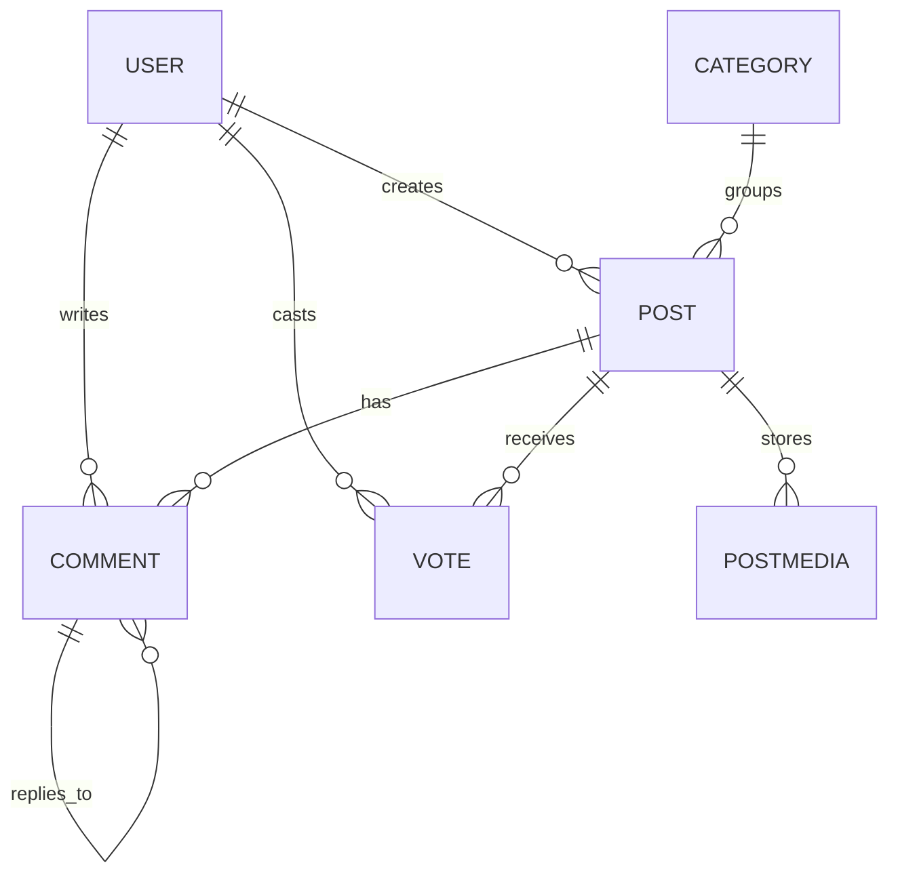

# Crow – Social Feed Platform

Crow is a database-backed Django social platform where registered users can create posts, upload media, vote on content, comment on discussions, reply to other users, search the feed, and manage their own content. The application demonstrates a complete full-stack workflow using Django, PostgreSQL, JavaScript, HTML, CSS, Git, GitHub, and Railway.

## Live Project

* Live site: [https://web-production-0574.up.railway.app/](https://web-production-0574.up.railway.app/)
* Repository: [https://github.com/boneyphilip/crow](https://github.com/boneyphilip/crow)

## Project Goals

### User goals

* Register and log in securely.
* Create and share posts with text and optional media.
* Discover interesting content through the feed and live search.
* Interact with posts through voting, comments, and replies.
* Edit or delete their own content without affecting other users.

### Site owner goals

* Provide a community-driven discussion platform.
* Store data in a structured relational database.
* Restrict sensitive actions to authenticated users.
* Deliver a responsive experience across device sizes.
* Deploy the application securely using environment variables.

## Project Rationale

Crow was designed as a Reddit-style social feed for users who want to share short-form content and interact with a community in a simple, familiar layout. The domain was chosen because it naturally supports relational data, user permissions, CRUD operations, and asynchronous interactions such as voting and search suggestions.

The project serves as a practical real-world example of a centrally managed dataset where:

* authenticated users create and manage their own records;
* visitors can browse public content;
* business rules control editing, deleting, and voting;
* the system gives clear feedback after user actions.

## UX Design

### Design principles

The interface was planned around five core UX principles:

1. **Clarity** – a familiar feed layout keeps the learning curve low.
2. **Consistency** – navigation, buttons, cards, and interaction patterns are repeated throughout the site.
3. **User control** – users can create, edit, delete, vote, and reply without confusion.
4. **Feedback** – Django messages and dynamic JavaScript updates confirm actions.
5. **Responsiveness** – layouts adapt across desktop, tablet, and mobile breakpoints.

### Typography and colour

* Primary font: Inter / system sans-serif
* Style direction: clean, neutral, social-feed inspired interface
* Colour approach: high-contrast text, white surfaces, soft grey dividers, and restrained accent states for actions

### Page structure

The project includes the following main views:

* Home feed
* Create post page
* Post detail page
* Edit post page
* Edit comment page
* Login page
* Register page
* Profile page

### Wireframes and planning notes

The final UI evolved from a simple social feed layout with these structural decisions:

* fixed navigation at the top for fast access to core actions;
* central content feed to keep attention on posts;
* post cards grouped into header, body, media, and action areas;
* separate create page for richer media upload handling;
* detail page for comments and threaded discussion.

A more detailed planning breakdown is documented in [UX.md](UX.md).

### Responsive mockups


## Agile Planning

The project uses an Agile planning structure based on epics, user stories, acceptance criteria, MoSCoW prioritisation, and implementation tasks. The full planning evidence is documented in [AGILE.md](AGILE.md).

### Agile summary

* Planning method: Agile / iterative development
* Tracking tools: GitHub Issues, GitHub commits, and a Kanban-style workflow
* Breakdown used: Epic → User Story → Tasks
* Prioritisation used: Must Have / Should Have / Could Have / Won't Have this iteration

## Existing Features

### Authentication and account access

* Users can register, log in, and log out.
* Restricted actions require authentication.
* The navigation reflects the current login state.

### Post CRUD functionality

* Authenticated users can create posts.
* Post authors can edit their own posts.
* Post authors can delete their own posts.
* Visitors and non-owners cannot access restricted edit/delete actions.

### Media handling

* Users can attach images, videos, and document-style uploads to posts.
* Single media and gallery layouts are handled separately.
* A lightbox viewer improves media browsing.

### Voting system

* Logged-in users can upvote or downvote posts.
* Clicking the same vote again removes it.
* Switching vote direction updates the score immediately.

### Comments and replies

* Logged-in users can comment on posts.
* Users can reply to comments to create threaded discussion.
* Users can edit or delete only their own comments.

### Search and discovery

* AJAX search returns matching posts and authors.
* Category suggestions are shown while creating posts.
* User profile pages display posts by a selected author.

### Responsive interface

* The layout adjusts across mobile, tablet, and desktop sizes.
* Navigation and feed content remain accessible on smaller screens.

## Future Improvements

* Follow / unfollow relationships between users
* Notifications for replies and interactions
* Category landing pages
* Saved posts / bookmarks
* Improved moderation tools for the site owner
* More detailed user profiles and avatars

## Data Model

Crow uses a relational database structure designed around users, posts, comments, votes, categories, and media.

### Entity relationship overview



### Model summary

#### Category

Stores reusable post categories. A category can be linked to many posts.

#### Post

Represents the main content item in the application. Each post belongs to one author and can optionally belong to one category.

#### Vote

Stores one vote per user per post. The `unique_together` constraint prevents duplicate votes from the same user on the same post.

#### Comment

Stores both comments and replies. A reply is represented by a self-referencing `parent` relationship.

#### PostMedia

Stores uploaded media linked to a post. Cloudinary handles media storage.

## Object-Oriented Programming in the Project

The project applies object-based software concepts through custom Django models:

* each domain entity is represented as a class;
* relationships are modelled using `ForeignKey` fields;
* business logic is encapsulated in model methods such as `get_score()` and `user_vote()`;
* model metadata and constraints help preserve data integrity.

## Security Features

* Django authentication system used for account management
* login protection on restricted routes
* object-level permission checks for editing and deleting posts/comments
* secret values stored in environment variables
* `.env` excluded through `.gitignore`
* production deployment uses `DEBUG=False`
* database connection handled through environment configuration

## Technologies Used

### Languages

* HTML
* CSS
* JavaScript
* Python

### Frameworks and libraries

* Django
* dj-database-url
* Cloudinary
* django-cloudinary-storage
* WhiteNoise
* Gunicorn

### Database and hosting

* SQLite for local development
* PostgreSQL for deployment
* Railway for hosting

### Tools and services

* Git
* GitHub
* Visual Studio Code
* ui-avatars.com for generated placeholder avatars
* Font Awesome / Material Icons

## Testing

Testing documentation has been expanded for resubmission and now includes:

* automated Django test coverage in `posts/tests.py` and `accounts/tests.py`;
* a structured manual testing matrix for core features and JavaScript interactions;
* browser testing, validator testing, and bug tracking notes.

Read the full testing evidence in [TESTING.md](TESTING.md).

## Deployment

### Local development

1. Clone the repository:

   ```bash
   git clone https://github.com/boneyphilip/crow.git
   cd crow
   ```
2. Create and activate a virtual environment:

   ```bash
   python -m venv .venv
   source .venv/bin/activate
   ```

   On Windows PowerShell use:

   ```powershell
   .venv\Scripts\Activate.ps1
   ```
3. Install dependencies:

   ```bash
   pip install -r requirements.txt
   ```
4. Create a local environment file:

   * copy `.env.example` to `.env`
   * add your own secret key and Cloudinary values
   * leave `DATABASE_URL` blank to use local SQLite during development
5. Run migrations:

   ```bash
   python manage.py migrate
   ```
6. Create a superuser if needed:

   ```bash
   python manage.py createsuperuser
   ```
7. Start the development server:

   ```bash
   python manage.py runserver
   ```

### Railway deployment

1. Push the final project to GitHub.
2. In Railway, create a new project and deploy from the GitHub repository.
3. Add a PostgreSQL service to the same Railway project.
4. In the web service variables, configure the application environment variables.
5. Set `DATABASE_URL` to the PostgreSQL service connection string.
6. Add the remaining required variables such as `SECRET_KEY`, `DEBUG`, `ALLOWED_HOSTS`, `CSRF_TRUSTED_ORIGINS`, and the Cloudinary keys.
7. Redeploy the service.
8. Open the deployment logs and confirm that migrations, collectstatic, and Gunicorn start successfully.
9. Generate a public domain from the Railway service settings.

### Required environment variables

* `SECRET_KEY`
* `DEBUG`
* `ALLOWED_HOSTS`
* `CSRF_TRUSTED_ORIGINS`
* `DATABASE_URL`
* `CLOUDINARY_CLOUD_NAME`
* `CLOUDINARY_API_KEY`
* `CLOUDINARY_API_SECRET`

### Procfile

The project uses the following web process:

```Procfile
web: sh -c "python manage.py migrate && python manage.py collectstatic --noinput && gunicorn crow.wsgi:application --bind 0.0.0.0:$PORT"
```

## Repository Structure

```text
crow/
├── accounts/
├── crow/
├── posts/
├── AGILE.md
├── TESTING.md
├── UX.md
├── .env.example
├── manage.py
├── Procfile
├── requirements.txt
└── runtime.txt
```

## Credits

### Code inspiration

* Code Institute course material and project assessment guidance
* General social feed interaction patterns inspired by community platforms such as Reddit

### Media and design resources

* Icons from Material Icons and Font Awesome
* Placeholder avatars from ui-avatars.com

### Platforms and services

* GitHub for version control and repository hosting
* Railway for cloud deployment
* Cloudinary for media storage

## Acknowledgements

This project was created as part of the Diploma in Full Stack Software Development and improved following assessor feedback to strengthen planning evidence, testing documentation, data schema explanation, and deployment guidance.

---

## FILE: TESTING.md

# Testing

This document records both automated and manual testing for the Crow project. It was expanded after assessor feedback to provide clear evidence of functionality, usability, responsiveness, JavaScript behaviour, and data handling.

## Testing Strategy

The testing approach for this project includes:

* automated Django tests for core authentication, CRUD, and permission rules;
* manual feature testing for all major user flows;
* JavaScript/manual UI testing for voting, dropdowns, and search interactions;
* responsiveness checks across device sizes;
* validator/linting checks;
* bug tracking and fixes.

## Automated Python Testing

Automated Django tests were added to provide baseline regression coverage.

### Accounts tests

File: `accounts/tests.py`

Covered areas:

* registration page loads successfully;
* user can register with valid data;
* login page loads successfully.

### Posts tests

File: `posts/tests.py`

Covered areas:

* home page renders;
* authenticated user can create a post;
* unauthenticated user is redirected from protected create route;
* post author can edit own post;
* non-author cannot edit another user's post;
* post author can delete own post;
* authenticated user can add a comment;
* users can vote on a post;
* search returns expected result;
* profile page loads for a valid user.

### Running tests locally

```bash
python manage.py test
```

## Manual Testing Matrix

| Feature                    | Test Steps                                                | Expected Result                                             | Actual Result |
| -------------------------- | --------------------------------------------------------- | ----------------------------------------------------------- | ------------- |
| Register account           | Open Register page, enter valid username/password, submit | User account created and redirected/logged in appropriately | Pass          |
| Login                      | Open Login page, enter valid credentials, submit          | User is logged in and navbar updates to authenticated state | Pass          |
| Logout                     | Click Logout                                              | User is logged out and restricted actions disappear         | Pass          |
| Home feed load             | Visit home page as guest                                  | Feed renders without error, posts visible                   | Pass          |
| Create post access control | Visit create post URL as guest                            | Redirect to login page or blocked from access               | Pass          |
| Create post                | Log in, complete create form, submit                      | Post saved and success message shown                        | Pass          |
| Create post validation     | Submit empty title/body or invalid data                   | Form errors displayed and record not created                | Pass          |
| Edit own post              | Log in as author, open edit page, change content, save    | Existing post updated and change visible in UI              | Pass          |
| Edit another user's post   | Log in as non-owner and access edit URL directly          | Action blocked with error/redirect                          | Pass          |
| Delete own post            | Log in as author, delete own post                         | Post removed and success message shown                      | Pass          |
| Delete another user's post | Log in as non-owner and access delete URL directly        | Action blocked with error/redirect                          | Pass          |
| View post detail           | Click a post from feed                                    | Correct post detail page opens                              | Pass          |
| Add comment                | Log in, open post detail, submit comment                  | Comment appears on page and in database                     | Pass          |
| Reply to comment           | Log in, reply to a comment                                | Reply appears nested under parent comment                   | Pass          |
| Edit own comment           | Log in as comment author, open edit comment, update text  | Comment updated successfully                                | Pass          |
| Delete own comment         | Log in as comment author, delete comment                  | Comment removed successfully                                | Pass          |
| Vote up                    | Click upvote on a post while logged in                    | Score updates immediately and vote state reflects selection | Pass          |
| Vote down                  | Click downvote on a post while logged in                  | Score updates immediately and vote state reflects selection | Pass          |
| Toggle same vote           | Click same vote twice                                     | Vote removed and score returns accordingly                  | Pass          |
| Live search                | Type matching keyword in search field                     | Matching posts/authors shown in dropdown                    | Pass          |
| Search close behaviour     | Click outside search box                                  | Search suggestions close without console errors             | Pass          |
| Navbar profile menu        | Click profile button                                      | Menu opens/closes correctly without console errors          | Pass          |
| Category suggestions       | Use create post page and type category                    | Suggestions appear where relevant                           | Pass          |
| Profile page               | Visit a user profile page                                 | User info and authored posts display correctly              | Pass          |
| Responsive navigation      | Check navbar on mobile width                              | Navigation remains usable and readable                      | Pass          |
| Feed responsiveness        | View home feed on tablet/mobile                           | Cards stack correctly with no overlap or cut-off content    | Pass          |
| Form feedback messages     | Perform create/edit/delete actions                        | Clear success or error feedback displayed                   | Pass          |
| Broken internal links      | Navigate through all key pages                            | No broken internal links encountered                        | Pass          |

## JavaScript Testing

The project includes several interactive JavaScript behaviours that were manually tested.

### Voting system (`post_detail.js` / feed interactions)

* verified score updates without full page reload;
* verified toggling the same vote removes it;
* verified switching from upvote to downvote updates score correctly;
* verified guest users cannot perform restricted vote actions.

### Search dropdown (`search.js`)

* verified results show when typing a matching query;
* verified dropdown hides when query is cleared;
* verified dropdown closes when clicking outside the search area;
* fixed selector mismatch so close behaviour uses the correct `.search-box` wrapper.

### Navbar menu (`navbar.js`)

* verified profile dropdown opens on click;
* verified profile dropdown closes when clicking elsewhere;
* fixed selector mismatch so script correctly targets `.nav-profile-btn`.

### Create post media/category interactions (`create_post.js`)

* verified media previews appear where expected;
* verified category suggestion logic responds to input;
* verified no blocking console errors during normal use.

## Responsiveness Testing

Manual checks were completed using browser developer tools and real browser resizing.

Tested breakpoints:

* mobile (~320px and above)
* tablet (~768px)
* desktop (~1024px and above)

Checked areas:

* navbar layout;
* home feed card spacing;
* post detail media layout;
* create/edit form layout;
* profile page layout.

Result: layouts remained functional and readable across tested widths.

## Browser Testing

The application was manually checked in modern browsers commonly available during development:

* Google Chrome
* Microsoft Edge
* Firefox

Result: core features worked consistently in tested browsers.

## Validation and Linting

### Python

* Python files were checked for PEP 8 compliance during development.
* No hardcoded secrets are present in the repository.

### HTML

* Templates were reviewed and corrected during development.
* No major template rendering errors remain in the final build.

### CSS

* Custom CSS files were reviewed for layout issues and media-query behaviour.

### JavaScript

* JavaScript files were reviewed through browser console testing.
* No major console-breaking issues remain in the fixed resubmission version.

## Bugs Found and Fixed

| Bug                                                                  | Status | Notes                                                         |
| -------------------------------------------------------------------- | ------ | ------------------------------------------------------------- |
| README contained incorrect GitHub Pages deployment instructions      | Fixed  | Replaced with Railway deployment and local setup instructions |
| Testing evidence too vague for assessment                            | Fixed  | Added detailed testing document and automated Django tests    |
| No clear Agile / planning evidence in repository                     | Fixed  | Added AGILE.md and linked it from README                      |
| No data schema explanation in README                                 | Fixed  | Added ERD and model descriptions                              |
| `navbar.js` targeted wrong selector                                  | Fixed  | Updated to use `.nav-profile-btn`                             |
| `search.js` click-outside logic targeted wrong wrapper               | Fixed  | Updated to use `.search-box`                                  |
| Edit views bypassed Django ModelForm validation                      | Fixed  | Refactored edit flows to use forms with `instance=`           |
| Missing local media fallback settings for non-Cloudinary development | Fixed  | Added local `MEDIA_URL` / `MEDIA_ROOT` fallback in settings   |

## Known Limitations

* Media-heavy behaviour may still depend on correct Cloudinary configuration when not using local fallback.
* Further automated JavaScript test tooling could be added in future for stronger front-end regression coverage.

## Conclusion

The Crow project now includes significantly stronger evidence for testing in line with Portfolio Project 4 requirements. Manual testing, automated testing, JavaScript behaviour checks, and documented bug fixes collectively support the quality and stability of the application for resubmission.

---

## FILE: AGILE.md

# Agile Planning

This document records the Agile planning evidence for Crow, including epics, user stories, acceptance criteria, task breakdown, and MoSCoW prioritisation. It was created to strengthen the planning documentation for Portfolio Project 4.

## Agile Method Used

The project followed an iterative Agile workflow:

* identify user and site-owner needs;
* group related work into epics;
* refine epics into user stories;
* break user stories into implementation tasks;
* prioritise work using MoSCoW;
* develop features incrementally and review after testing.

The practical workflow used GitHub for repository management, commits for feature history, and a Kanban-style development approach for tracking progress.

## Project Goals Mapped to Planning

### Main project goals

1. Build a community-based social feed using Django.
2. Provide secure authentication and authorisation.
3. Deliver full CRUD functionality for posts and comments.
4. Support rich interaction through voting, replies, and search.
5. Deploy securely with production-ready configuration.

## Epics

### Epic 1 – Authentication and user access

Focus: account registration, login/logout, restricted actions, and authenticated navigation.

### Epic 2 – Post creation and management

Focus: creating, viewing, editing, and deleting posts.

### Epic 3 – Social interaction

Focus: comments, replies, and voting.

### Epic 4 – Discovery and usability

Focus: search, profile views, responsive layout, and navigation clarity.

### Epic 5 – Deployment, testing, and documentation

Focus: secure deployment, README quality, testing evidence, and project documentation.

## User Stories

### Must Have

#### US01 – Register account

As a site user, I want to create an account so that I can participate in the platform.

**Acceptance criteria**

* A registration form is available.
* Valid user details create a new account.
* The user can then log in.

**Tasks**

* Build registration form.
* Validate submitted data.
* Save user account.
* Link registration in navigation.

#### US02 – Log in and log out

As a registered user, I want to log in and log out so that I can access protected features securely.

**Acceptance criteria**

* Login form accepts valid credentials.
* Invalid credentials do not authenticate the user.
* Logout ends the authenticated session.

**Tasks**

* Configure authentication views.
* Add login/logout templates.
* Update navbar based on login state.

#### US03 – Create post

As an authenticated user, I want to create a post so that I can share content with the community.

**Acceptance criteria**

* Logged-in users can access the create post page.
* A valid form creates a post.
* A success message is shown after submission.

**Tasks**

* Build post form.
* Save post author automatically.
* Redirect after success.
* Display Django feedback messages.

#### US04 – View feed and post details

As a visitor, I want to browse posts so that I can discover content without needing an account.

**Acceptance criteria**

* Home page displays existing posts.
* Users can open a detailed post view.
* Page loads are responsive and readable.

**Tasks**

* Build feed query and template.
* Build post detail view.
* Add media rendering rules.

#### US05 – Edit own post

As a post author, I want to edit my own post so that I can correct or improve it.

**Acceptance criteria**

* Only the author can access the edit action.
* Existing content is prefilled in the form.
* Saved changes are visible immediately.

**Tasks**

* Create edit form.
* Enforce author-only access.
* Validate edits using ModelForm.

#### US06 – Delete own post

As a post author, I want to delete my own post so that I can remove content I no longer want published.

**Acceptance criteria**

* Only the author can delete the post.
* User is asked to confirm the action.
* Deleted post disappears from the UI.

**Tasks**

* Build delete confirmation page.
* Enforce permission checks.
* Redirect with success message.

#### US07 – Comment on a post

As an authenticated user, I want to comment on a post so that I can join the discussion.

**Acceptance criteria**

* Logged-in users can submit comments.
* New comments appear on the post detail page.
* Guests cannot submit restricted comment actions.

**Tasks**

* Add comment form.
* Link comment to author and post.
* Render comments in detail template.

#### US08 – Reply to a comment

As an authenticated user, I want to reply to another comment so that threaded conversations are possible.

**Acceptance criteria**

* Reply is linked to a parent comment.
* Replies are displayed under the correct comment.
* Non-logged-in users cannot reply.

**Tasks**

* Add self-referencing comment relationship.
* Handle parent comment in view logic.
* Render nested replies.

#### US09 – Vote on a post

As an authenticated user, I want to upvote or downvote posts so that I can express interest or disagreement.

**Acceptance criteria**

* Users can cast one vote per post.
* Voting again on the same option removes the vote.
* The score updates correctly.

**Tasks**

* Create vote model.
* Add unique user/post vote rule.
* Build AJAX vote handling.
* Update score in UI.

### Should Have

#### US10 – Search posts

As a visitor, I want to search the platform so that I can quickly find matching content.

**Acceptance criteria**

* Typing a query returns matching results.
* Results are relevant to titles, content, or authors.
* Search suggestions can be closed cleanly.

**Tasks**

* Build search query view.
* Add JavaScript dropdown rendering.
* Add click-outside close behaviour.

#### US11 – View profile page

As a visitor, I want to view a user profile so that I can see their public contributions.

**Acceptance criteria**

* Profile page loads for valid users.
* User posts are displayed on the profile page.
* Invalid users return an appropriate result.

**Tasks**

* Create profile route and template.
* Query posts by author.
* Display profile header information.

#### US12 – Responsive layout

As a user on any device, I want the platform to remain usable so that I can browse and interact comfortably.

**Acceptance criteria**

* Navigation remains accessible on small screens.
* Feed cards do not overlap or overflow.
* Forms remain readable and usable on mobile.

**Tasks**

* Add responsive CSS rules.
* Test breakpoints.
* Adjust spacing and stacking.

### Could Have

#### US13 – Category suggestions

As a content creator, I want category assistance so that tagging posts is faster.

#### US14 – Media gallery enhancement

As a user, I want a smoother media-viewing experience so that image and file browsing feels polished.

## MoSCoW Prioritisation Summary

### Must Have

* Registration and login
* Auth-aware navigation
* Post CRUD
* Commenting and replies
* Voting
* Permission enforcement
* Responsive feed and core layouts

### Should Have

* Live search
* Profile pages
* Additional UX refinements

### Could Have

* Category suggestion improvements
* More advanced gallery/lightbox enhancements

### Won't Have in this iteration

* Follow system
* Notifications
* Bookmarks
* Moderator dashboard

## Acceptance Criteria Quality

Each core story was planned around testable outcomes:

* access control;
* visible feedback;
* successful database change;
* immediate reflection in the UI where applicable.

This helps map the project directly to both feature implementation and testing evidence.

## Evidence of Epic → Story → Task Refinement

Example refinement path:

**Epic:** Post creation and management
**User Story:** As an authenticated user, I want to create a post so that I can share content.
**Tasks:**

* build form;
* save author automatically;
* validate fields;
* redirect on success;
* show confirmation message.

This same refinement pattern was used across the main project features.

## How Agile Planning Maps to the Final Project

* Authentication epic maps to the accounts app and navbar state.
* Post management epic maps to post CRUD views, templates, and forms.
* Social interaction epic maps to comments, replies, and votes.
* Discovery epic maps to search, profiles, and responsive navigation.
* Deployment/documentation epic maps to Railway setup, testing evidence, README, and security configuration.

## Recommended GitHub Project Evidence for Resubmission

To further strengthen resubmission evidence, the following should be visible in the repository:

* GitHub Issues created from the user stories;
* a GitHub Project board or Kanban board;
* labels for Must Have / Should Have / Could Have;
* closed issues linked to completed features where possible.

## Conclusion

The Crow project was developed with an Agile mindset and iterative feature delivery, but the original repository documentation did not fully show this clearly enough. This document provides the missing evidence by explicitly recording epics, user stories, acceptance criteria, and prioritisation for the final resubmission.

---

## FILE: UX.md

# UX Design Notes

This document expands on the design reasoning behind Crow and complements the README.

## Target Audience

Crow is aimed at users who want a lightweight and familiar discussion platform where they can:

* share short posts quickly;
* browse community content easily;
* interact through votes and comments;
* access the site comfortably across device sizes.

The audience expects a familiar social-feed style experience with low friction and clear actions.

## UX Goals

The main UX goals were:

* make the purpose of the site obvious immediately;
* reduce cognitive load through a familiar feed layout;
* make primary actions easy to find;
* provide clear feedback after user actions;
* support both guests and logged-in users without confusion.

## Information Hierarchy

The information hierarchy was planned as follows:

1. Navigation first – users should always know how to move around the site.
2. Feed content second – posts are the main value of the platform.
3. Social actions third – voting, commenting, replying, and editing should be easy to discover but should not overwhelm the content.
4. Supporting metadata last – author, category, and timestamps support context without dominating the layout.

## Layout Decisions

### Navigation

A fixed top navigation was used to keep key actions available:

* Home
* Create Post
* Login / Register or Profile / Logout
* Search

This improves discoverability and reduces the need for excessive page travel.

### Feed cards

Posts were displayed in card-style blocks because this pattern is familiar from social platforms and makes scanning easier. Each card is separated into:

* header (author/category/time)
* content body
* media area
* interaction area

### Detail view

A dedicated post detail page was used so comments and replies could be displayed without overcrowding the main feed.

### Create/edit pages

Separate create and edit pages reduce clutter and make form handling clearer, especially when media uploads are involved.

## User Control and Feedback

The project aims to keep users in control by:

* restricting edit/delete actions to content owners;
* providing visible Django success/error messages;
* using immediate UI updates for actions such as voting;
* avoiding autoplay or aggressive popups.

## Accessibility Considerations

The project was designed with the following accessibility considerations in mind:

* readable contrast between text and background;
* responsive spacing to avoid cramped layouts;
* clear button labels and visible interactive states;
* semantic template structure where possible;
* navigation that remains accessible on smaller screens.

## Responsive Strategy

The responsive strategy focused on preserving usability rather than only shrinking content. This included:

* stacking content vertically on smaller screens;
* reducing spacing and resizing cards without losing readability;
* keeping navigation usable across breakpoints;
* ensuring forms remain legible and tap-friendly.

## Future UX Improvements

Possible future UX refinements include:

* clearer empty states for search and profiles;
* richer user profile customisation;
* notification indicators for replies and interactions;
* bookmark/save patterns for content discovery.

## Conclusion

The UX design of Crow was intentionally based on familiar community-platform patterns so users could understand the site quickly. The goal was not novelty for its own sake, but clarity, usability, responsiveness, and strong alignment with the project’s full-stack social platform purpose.
